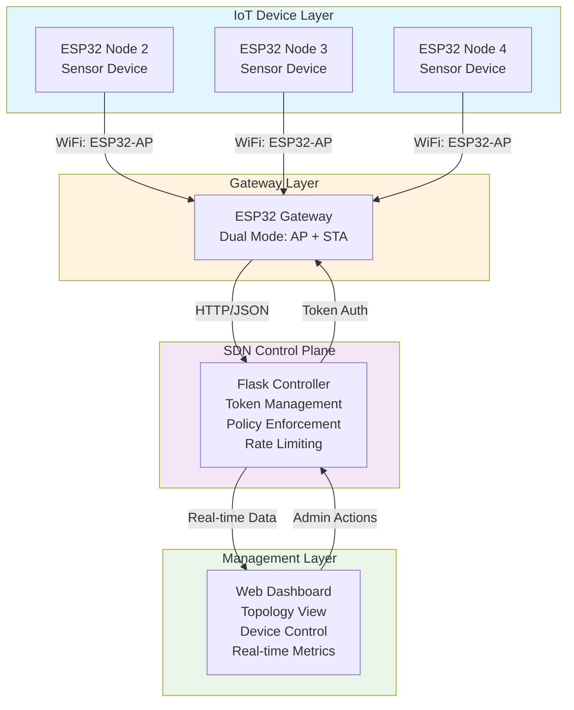

# 🔐 ZerIoT - Zero Trust SDN Framework for IoT Security

[](https://www.python.org/downloads/)
[](https://flask.palletsprojects.com/)
[](https://www.espressif.com/en/products/socs/esp32)
[](https://opensource.org/licenses/MIT)
[](https://github.com/AnirudhDattu/ZerIoT-Zero-Trust-SDN-Framework-for-IoT-Security)
[](https://github.com/AnirudhDattu/ZerIoT-Zero-Trust-SDN-Framework-for-IoT-Security)

## 📖 Overview

**ZerIoT** is a comprehensive Zero Trust Software-Defined Networking (SDN) framework designed specifically for IoT security. Built using ESP32 microcontrollers, Flask web framework, and Python, ZerIoT implements enterprise-grade security mechanisms including token-based device authentication, automatic session timeouts, rate limiting, real-time device authorization revocation, and dynamic SDN policy enforcement. The framework features an advanced real-time dashboard with network topology visualization, enabling administrators to monitor, control, and secure IoT devices effectively in a distributed environment.

---

## 🏗️ Architecture Diagram



**Data Flow:**
1. 🔹 ESP32 nodes connect to Gateway via WiFi AP
2. 🔹 Nodes request authentication tokens from Controller via Gateway
3. 🔹 Controller validates devices and issues time-limited tokens
4. 🔹 Nodes send sensor data with tokens to Controller through Gateway
5. 🔹 Controller enforces SDN policies (rate limiting, session timeout, access control)
6. 🔹 Dashboard displays real-time topology, metrics, and allows admin control

---

## ✨ Features

- 🔐 **Token-Based Authentication**: Secure device authentication using dynamically generated unique tokens
- ⏱️ **Session Timeout Management**: Automatic 5-minute session expiry with token invalidation
- 🚦 **Rate Limiting**: Per-device packet rate control (60 packets/minute) to prevent DoS attacks
- 🔄 **Real-Time Authorization Revocation**: Instant device access revocation via dashboard
- 📊 **SDN Policy Enforcement**: Dynamic policies including packet inspection, traffic shaping, and routing
- 🗺️ **Network Topology Visualization**: Interactive topology graph using vis-network.js
- 📈 **Live Metrics Dashboard**: Real-time packet counts, device status, and health metrics
- 🎯 **Anomaly Detection**: Automatic blocking during maintenance windows
- 📝 **Policy Audit Logs**: Comprehensive logging of all policy changes and enforcement actions
- 🌐 **Gateway Architecture**: ESP32 dual-mode gateway (AP + STA) for flexible deployment
- 🔍 **MAC Address Tracking**: Device identification and tracking via MAC addresses
- ⚡ **Control Plane Monitoring**: SDN metrics including latency, throughput, and policy enforcement rate

---

## 🛠️ Tech Stack

### Backend
- 🐍 **Python 3.8+**: Core application logic
- 🌶️ **Flask 2.0+**: Web framework for controller and dashboard
- 📊 **Matplotlib 3.5+**: Data visualization and graph generation

### Frontend
- 🎨 **HTML5/CSS3**: Dashboard UI with gradient styling
- 📡 **JavaScript**: Real-time data updates via AJAX
- 🕸️ **vis-network.js**: Network topology visualization

### IoT Hardware
- 🔧 **ESP32**: WiFi-enabled microcontroller for nodes and gateway
- ⚙️ **Arduino IDE**: ESP32 firmware development
- 📶 **WiFi (802.11)**: Wireless communication protocol

### Libraries & Frameworks
- 🔢 **ArduinoJson**: JSON parsing on ESP32
- 🌐 **HTTPClient**: HTTP requests from ESP32
- 🔄 **uuid**: Token generation
- 📅 **datetime**: Timestamp management

---

## 📦 Installation

### Prerequisites

- Python 3.8 or higher
- pip package manager
- Arduino IDE (for ESP32 programming)
- ESP32 development boards (1 gateway + multiple nodes)

### Controller Setup

1. **Clone the repository**
   ```bash
   git clone https://github.com/AnirudhDattu/ZerIoT-Zero-Trust-SDN-Framework-for-IoT-Security.git
   cd ZerIoT-Zero-Trust-SDN-Framework-for-IoT-Security
   ```

2. **Install Python dependencies**
   ```bash
   pip install -r requirements.txt
   ```

3. **Run the Flask controller**
   ```bash
   python controller.py
   ```
   The controller will start on `http://0.0.0.0:5000`

### ESP32 Gateway Setup

1. **Open Arduino IDE** and install ESP32 board support
2. **Install required libraries**:
   - WiFi (built-in)
   - HTTPClient (built-in)
   - ArduinoJson

3. **Configure Gateway** (`esp32/gateway.ino`):
   ```cpp
   const char *ap_ssid = "ESP32-AP";
   const char *ap_password = "12345678";
   const char *sta_ssid = "YourWiFi";        // Your WiFi network
   const char *sta_password = "YourPassword";
   const char *controller_ip = "192.168.1.100"; // Your laptop/server IP
   ```

4. **Upload** to ESP32 Gateway board

### ESP32 Node Setup

1. **Configure Node** (`esp32/node.ino`):
   ```cpp
   const char *ssid = "ESP32-AP";
   const char *password = "12345678";
   const char *controller_ip = "192.168.4.1";
   String device_id = "ESP32_2";  // Change for each node: ESP32_2, ESP32_3, ESP32_4
   ```

2. **Upload** to each ESP32 Node board (update `device_id` for each node)

---

## 🚀 Usage

### Starting the System

1. **Start the Controller**:
   ```bash
   python controller.py
   ```

2. **Power on ESP32 Gateway**: It will create AP "ESP32-AP" and connect to your WiFi

3. **Power on ESP32 Nodes**: They will:
   - Connect to Gateway AP
   - Request authentication tokens
   - Start sending sensor data every 5 seconds

### Accessing the Dashboard

Open your web browser and navigate to:
```
http://localhost:5000
```

or (from network):
```
http://<controller-ip>:5000
```

### Dashboard Features


*Real-time device monitoring and control interface*

**Device Overview Table**:
- View all connected devices
- Check authorization status
- Monitor packet counts
- See rate limit status
- Authorize/Revoke devices instantly


*Interactive network topology with MAC addresses*

**Network Topology**:
- Visual representation of device connections
- Gateway-centric topology view
- Real-time connection status
- MAC address identification


*Dynamic SDN policy management*

**SDN Policy Controls**:
- Enable/Disable packet inspection
- Toggle traffic shaping
- Configure dynamic routing
- View policy enforcement logs
- Monitor control plane metrics

### Device Data Flow

1. **Token Request**:
   ```json
   POST /get_token
   {"device_id": "ESP32_2", "mac_address": "AA:BB:CC:DD:EE:FF"}
   ```

2. **Data Submission**:
   ```json
   POST /data
   {
     "device_id": "ESP32_2",
     "token": "unique-token-here",
     "timestamp": "1234567890",
     "data": "25.5"
   }
   ```

3. **Response**: 
   - `{"status": "accepted"}` - Data accepted
   - `{"status": "rejected", "reason": "..."}` - Access denied

---

## 📁 Repository Structure

```
ZerIoT-Zero-Trust-SDN-Framework-for-IoT-Security/
│
├── 📄 controller.py              # Flask-based SDN controller
│   ├── Token management & validation
│   ├── Device authorization & revocation
│   ├── Rate limiting enforcement
│   ├── SDN policy engine
│   └── Dashboard API endpoints
│
├── 📁 templates/
│   └── dashboard.html            # Real-time monitoring dashboard
│       ├── Device status table
│       ├── Network topology visualization
│       ├── SDN policy controls
│       ├── Health metrics display
│       └── Policy enforcement logs
│
├── 📁 static/
│   └── vis-network.min.js        # Network visualization library
│
├── 📁 esp32/
│   ├── gateway.ino               # ESP32 Gateway firmware
│   │   ├── Dual-mode WiFi (AP + STA)
│   │   ├── Data forwarding to controller
│   │   └── HTTP server for nodes
│   │
│   └── node.ino                  # ESP32 Node firmware
│       ├── WiFi connection management
│       ├── Token acquisition
│       ├── Sensor data generation
│       └── Periodic data transmission
│
├── 📁 docs/
│   ├── NIST.SP.800-207.pdf       # Zero Trust Architecture reference
│   └── futureinternet-06-00302.pdf  # SDN for IoT research paper
│
├── 📄 requirements.txt            # Python dependencies
├── 📄 .gitignore                 # Git ignore rules
├── 📄 LICENSE                    # MIT License
└── 📄 README.md                  # This file
```

---

## 🤝 Contributing

Contributions are welcome! Here's how you can help improve ZerIoT:

### How to Contribute

1. **Fork** the repository
2. **Create** a feature branch (`git checkout -b feature/AmazingFeature`)
3. **Commit** your changes (`git commit -m 'Add some AmazingFeature'`)
4. **Push** to the branch (`git push origin feature/AmazingFeature`)
5. **Open** a Pull Request

### Areas for Contribution

- 🔒 Enhanced security features (encryption, certificate-based auth)
- 📊 Additional sensor types and protocols
- 🎨 Dashboard UI/UX improvements
- 📱 Mobile app development
- 🧪 Unit and integration tests
- 📚 Documentation improvements
- 🐛 Bug fixes and performance optimizations

### Reporting Issues

Found a bug or have a suggestion? Please [open an issue](https://github.com/AnirudhDattu/ZerIoT-Zero-Trust-SDN-Framework-for-IoT-Security/issues) with:
- Clear description of the problem/suggestion
- Steps to reproduce (for bugs)
- Expected vs actual behavior
- Screenshots (if applicable)

---

## 📄 License

This project is licensed under the **MIT License** - see below for details.

```
MIT License

Copyright (c) 2024 ZerIoT Contributors

Permission is hereby granted, free of charge, to any person obtaining a copy
of this software and associated documentation files (the "Software"), to deal
in the Software without restriction, including without limitation the rights
to use, copy, modify, merge, publish, distribute, sublicense, and/or sell
copies of the Software, and to permit persons to whom the Software is
furnished to do so, subject to the following conditions:

The above copyright notice and this permission notice shall be included in all
copies or substantial portions of the Software.

THE SOFTWARE IS PROVIDED "AS IS", WITHOUT WARRANTY OF ANY KIND, EXPRESS OR
IMPLIED, INCLUDING BUT NOT LIMITED TO THE WARRANTIES OF MERCHANTABILITY,
FITNESS FOR A PARTICULAR PURPOSE AND NONINFRINGEMENT. IN NO EVENT SHALL THE
AUTHORS OR COPYRIGHT HOLDERS BE LIABLE FOR ANY CLAIM, DAMAGES OR OTHER
LIABILITY, WHETHER IN AN ACTION OF CONTRACT, TORT OR OTHERWISE, ARISING FROM,
OUT OF OR IN CONNECTION WITH THE SOFTWARE OR THE USE OR OTHER DEALINGS IN THE
SOFTWARE.
```

---

## 🌟 Acknowledgments

- **NIST SP 800-207**: Zero Trust Architecture guidelines
- **vis.js**: Network visualization library
- **ESP32 Community**: Hardware and firmware support
- **Flask Community**: Web framework and extensions

---

## 📞 Contact & Support

- **GitHub Issues**: [Report bugs or request features](https://github.com/AnirudhDattu/ZerIoT-Zero-Trust-SDN-Framework-for-IoT-Security/issues)
- **Repository**: [github.com/AnirudhDattu/ZerIoT-Zero-Trust-SDN-Framework-for-IoT-Security](https://github.com/AnirudhDattu/ZerIoT-Zero-Trust-SDN-Framework-for-IoT-Security)

---

## 🎓 Educational Purpose

This project demonstrates:
- Zero Trust security principles in IoT environments
- Software-Defined Networking (SDN) concepts
- Token-based authentication mechanisms
- Real-time monitoring and control systems
- ESP32 microcontroller programming
- Full-stack IoT application development

Perfect for students, researchers, and professionals interested in IoT security, SDN, and embedded systems!

---

<div align="center">

### ⭐ Star this repository if you find it helpful!

**Made with ❤️ for IoT Security**

</div>
